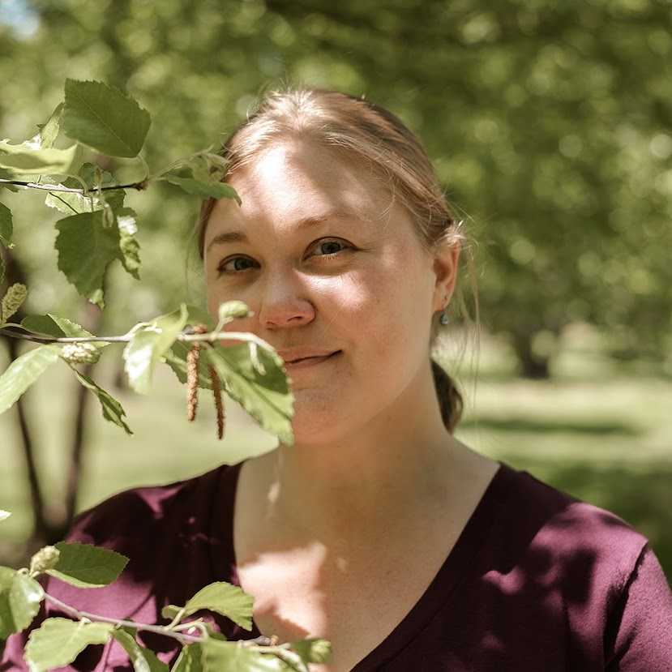

  <h1>About Me</h1>
  
  
Reader, writer, and environmental steward.

<h1 style="text-align:center">Research Interests</h1>

  

    

      

        <h2>Streams and rivers</h2>
        
As a volunteer master watershed steward, I am interested in how our lives on land affect the water near us--and vice versa.

      

    

  

  

    

      

        <h2>Urban ecology</h2>
        
Whether gardening, foraging, or maintaining green stormwater infrastructure, I am interested in the plants that grow in our urban habitat.

      

    

  

  

    

      

        <h2>Communication</h2>
        
I have been a professional writer for nearly 13 years, and my PhD is in literary studies. Only recently have I found my own writerly voice. 

      

    

  

